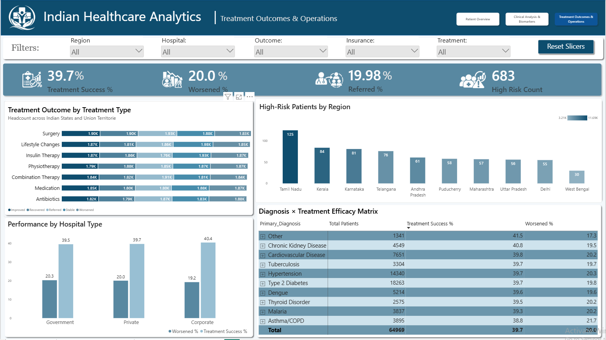
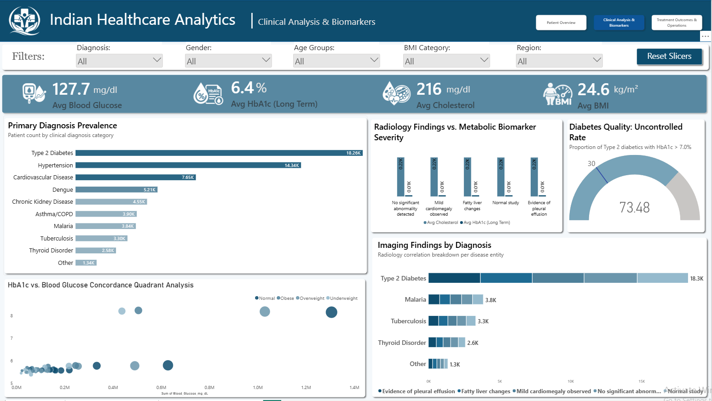

# 🏥 Indian Healthcare Analytics | End-to-End Power BI Dashboard

[](https://www.python.org/)
[](https://pandas.pydata.org/)
[](https://numpy.org/)
[](https://www.postgresql.org/)
[](https://powerbi.microsoft.com/)
[](https://opensource.org/licenses/MIT)

---

## 📌 Project Summary

An enterprise-grade, end-to-end healthcare analytics project examining **100000+ patient visits** across government, private, and corporate hospitals in India. 

The project uncovers actionable insights into **chronic disease prevalence (Diabetes, Hypertension, CVD)**, **treatment efficacy rates**, **metabolic risk biomarkers**, and **socioeconomic healthcare disparities**.

---

## 🏗️ Architecture & Pipeline Flow

```text
┌────────────────────────┐       ┌────────────────────────┐       ┌────────────────────────┐       ┌────────────────────────┐
│      Kaggle Dataset    │       │     Python (ETL)       │       │    PostgreSQL (DWH)    │       │   Power BI Dashboard   │
│   (~100K+ Raw Records) │ ────> │  - Data Cleaning       │ ────> │  - Star Schema Design  │ ────> │  - 3-Page Report       │
│  - Demographics        │       │  - Outlier Handling    │       │  - Fact & Dimensions   │       │  - Interactive Slicers │
│  - Clinical Biomarkers │       │  - Feature Engineering │       │  - Optimized Views     │       │  - DAX Measures & KPIs │
│  - Billing & Outcomes  │       │  - NumPy / Pandas      │       │  - DirectQuery / Model │       │  - Cross-Filtering     │
└────────────────────────┘       └────────────────────────┘       └────────────────────────┘       └────────────────────────┘
```

---

## 🖥️ Dashboard Previews & Key Findings

### 📄 Page 1: Treatment Outcomes & Operations
> **Focus:** Clinical effectiveness, referral bottlenecks, hospital sector benchmarking, and operational high-risk tracking.



#### 🎯 Key Metrics & Highlights:
- **Treatment Success Rate:** `39.7%` overall favorable outcome.
- **Worsened Outcome Rate:** `20.0%` of cases deteriorate during intervention.
- **Referred Rate:** `19.98%` requiring transfer to tertiary facilities.
- **High-Risk Patient Count:** `683` critical individuals flagged for immediate care.
- **Sector Analysis:** Direct performance comparison across **Government**, **Private**, and **Corporate** healthcare providers.
- **Geographic Vulnerability:** Regional concentration identifying highest high-risk volumes in states like **Tamil Nadu** and **Kerala**.
- **Diagnosis × Treatment Efficacy Matrix:** Granular cross-tabulation mapping treatment protocols against outcomes across all diagnoses.

---

### 📄 Page 2: Clinical Analysis & Biomarkers
> **Focus:** Population metabolic profiles, glycemic control benchmarks, chronic condition ranking, and radiological correlation.



#### 🎯 Key Metrics & Highlights:
- **Avg Blood Glucose:** `127.7 mg/dL`
- **Avg HbA1c:** `6.4%` (Pre-diabetic population baseline average)
- **Avg Cholesterol:** `216.0 mg/dL` (Elevated cardiovascular risk profile)
- **Avg BMI:** `24.6 kg/m²` (Upper normal / overweight threshold)
- **Top Conditions:** **Type 2 Diabetes (18.26K)**, **Hypertension (14.34K)**, and **Cardiovascular Disease (7.65K)**.
- **Diabetes Quality Indicator:** **`73.48%` Uncontrolled Rate** (HbA1c > 7.0%), identifying a critical public health gap in diabetic management.
- **Quadrant Concordance:** Scatter plot correlating acute blood glucose against 3-month HbA1c grouped by BMI categories (Underweight, Normal, Overweight, Obese).
- **Radiology vs. Biomarker Severity:** Multi-variable analysis comparing abnormal imaging findings against elevated cholesterol and glycemic index.

---

### 📄 Page 3: Patient Overview & Demographics
> **Focus:** Public health demographics, health equity, socioeconomic stratifications, insurance penetration, and seasonality.


#### 🎯 Key Metrics & Highlights:
- **Total Patient Visits Analyzed:** `64,969` (64.97K)
- **Insurance Penetration Rate:** `35.03%` (Highlighting significant out-of-pocket exposure)
- **Average Patient Age:** `44.4 Years`
- **Sex Ratio (M:F):** `1.06`
- **Socioeconomic Status (SES) Breakdown:** Cross-analyzed by age groups (Young, Middle-aged, Senior) and hospital type preference.
- **Insurance by Hospital Type:** Donut distribution showing private/corporate facilities capturing the majority of insured visits.
- **Visit Seasonality:** Monthly trend tracking peak admission waves throughout the calendar year.

---

## 📂 Repository Structure

```text
indian-healthcare-analytics/
│
├── README.md                      # Comprehensive project documentation
├── .gitignore                     # Git exclusion rules
├── data_cleaning.py               # Python ETL, validation & outlier treatment script
├── schema_and_queries.sql         # SQL Star Schema (DDL) + Analytical Views
│
├── assets/                        # Dashboard screenshots & media
│   ├── dashboard_page1.png        # Screenshot: Treatment Outcomes & Operations
│   ├── dashboard_page2.png        # Screenshot: Clinical Analysis & Biomarkers
│   └── dashboard_page3.png        # Screenshot: Patient Overview & Demographics
│
├── powerbi/
│   └── indian_healthcare.pbix     # Power BI report workbook (3 pages)
│
└── data/
    ├── raw/                       # Raw Kaggle CSV (gitignored)
    └── processed/                 # Cleaned dataset ready for SQL ingestion
```

---

## 🧠 Star Schema Data Model (SQL)

The data warehouse is modeled as a high-performance **Star Schema**:

```text
                  ┌────────────────────────┐
                  │      dim_patients      │
                  ├────────────────────────┤
                  │ PK: patient_id         │
                  │     age, gender        │
                  │     socioeconomic_tier │
                  │     insurance_status   │
                  └───────────┬────────────┘
                              │ 1
                              │
                              │ M
┌──────────────────┐    ┌─────┴───────────────────┐    ┌──────────────────┐
│  dim_geography   │    │       fact_visits       │    │  dim_hospitals   │
├──────────────────┤    ├─────────────────────────┤    ├──────────────────┤
│ PK: geo_id       │ 1  │ PK: visit_id            │  1 │ PK: hospital_id  │
│     state        ├────┤ FK: patient_id          ├────┤     hospital_name│
│     region_tier  │  M │ FK: hospital_id         │  M │     sector_type  │
│     urban_rural  │    │ FK: geo_id              │    │     bed_capacity │
└──────────────────┘    │     admission_date      │    └──────────────────┘
                        │     primary_diagnosis   │
                        │     treatment_type      │
                        │     glucose, hba1c      │
                        │     cholesterol, bmi    │
                        │     outcome_status      │
                        │     length_of_stay      │
                        └─────────────────────────┘
```

---

## 🧮 Sample DAX Measures

```dax
// 1. Treatment Success Rate %
Treatment_Success_Rate = 
DIVIDE(
    CALCULATE(COUNTROWS(fact_visits), fact_visits[outcome_status] = "Recovered" || fact_visits[outcome_status] = "Improved"),
    COUNTROWS(fact_visits),
    0
)

// 2. Uncontrolled Diabetes Rate (>7.0% HbA1c)
Uncontrolled_Diabetes_Rate = 
DIVIDE(
    CALCULATE(
        COUNTROWS(fact_visits),
        fact_visits[primary_diagnosis] = "Type 2 Diabetes",
        fact_visits[hba1c] > 7.0
    ),
    CALCULATE(
        COUNTROWS(fact_visits),
        fact_visits[primary_diagnosis] = "Type 2 Diabetes"
    ),
    0
)

// 3. High Risk Patient Flag
High_Risk_Patients = 
CALCULATE(
    COUNTROWS(fact_visits),
    fact_visits[glucose] > 180 || fact_visits[hba1c] > 8.5 || fact_visits[cholesterol] > 240
)
```

---

## 🚀 Quickstart & Setup Guide

### 1. Clone the Repo
```bash
git clone https://github.com/<YOUR-USERNAME>/indian-healthcare-analytics.git
cd indian-healthcare-analytics
```

### 2. Environment Setup & Data Cleaning
```bash
# Create virtual environment
python -m venv venv
source venv/bin/activate  # On Windows: venv\Scripts\activate

# Install dependencies
pip install pandas numpy

# Run ETL script
python data_cleaning.py
```

### 3. Database Ingestion (PostgreSQL / SQL Server)
```bash
# Run DDL and view creation scripts
psql -U postgres -d healthcare_db -f schema_and_queries.sql
```

### 4. Launch Power BI
1. Open `powerbi/indian_healthcare.pbix` in **Power BI Desktop**.
2. Go to **Transform Data** > **Data Source Settings** to connect to your local database or processed CSV.
3. Click **Refresh** to load the clean data and explore the interactive report!

---

## 💡 Strategic Recommendations
1. **Targeted Glycemic Interventions:** Given the **73.48% uncontrolled diabetes rate**, deploy community health programs focused on routine HbA1c monitoring.
2. **Insurance Expansion in Rural/Government Tiers:** Only **35.03%** of patients hold insurance; public subsidies must prioritize out-of-pocket reduction for primary care.
3. **Specialized Referral Centers in High-Burden States:** Regions like Tamil Nadu and Kerala show elevated high-risk counts; establish dedicated tertiary care hubs to curb the ~20% referral rate.

---

## 👤 Author
- **Portfolio / Project:** Indian Healthcare Analytics
- **Tools:** Python | SQL | Power BI | Data Modeling
- **Connect:** [LinkedIn](https://linkedin.com) | [GitHub](https://github.com)

---

## 📜 License
This project is open-source under the [MIT License](LICENSE).
